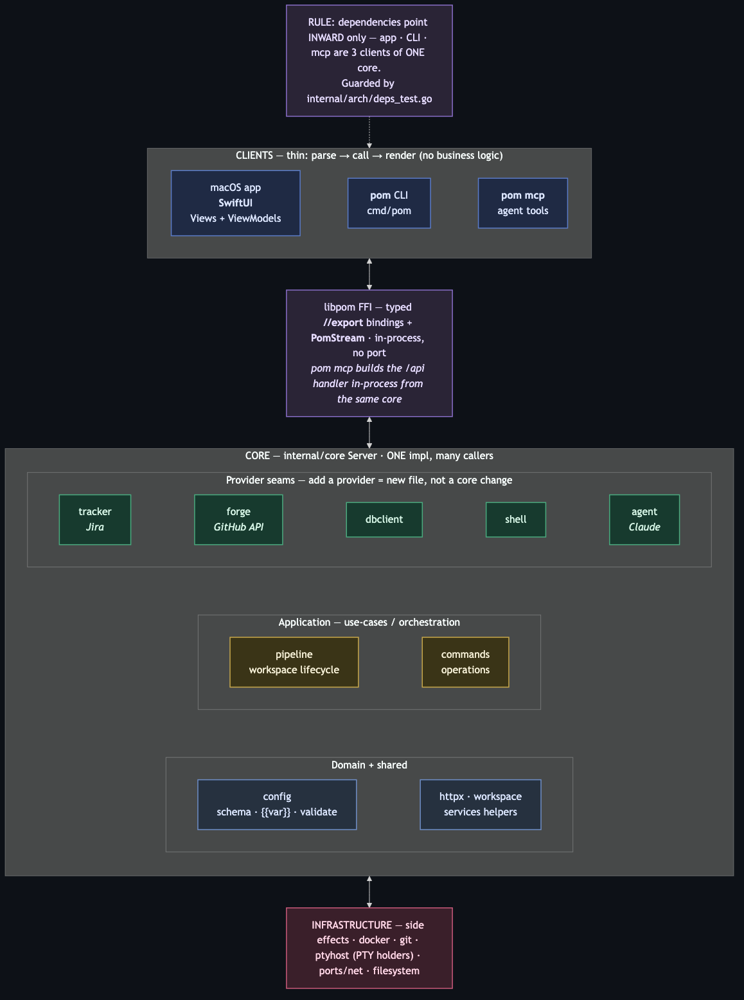

# Pomelo — Architecture

> Source: `docs/diagrams/architecture.mmd` (render: `npx @mermaid-js/mermaid-cli
> -i architecture.mmd -o architecture.png -t dark -b '#0d1117' -w 1800`).

Pomelo is a Go core (`internal/*`) driven by a **native SwiftUI macOS app**
(`desktop/PomeloApp`) linked in-process through the `libpom` c-archive FFI. There
is **no TUI** (removed v0.8.0), **no tmux** (services run on self-managed PTY
holders, v0.8.205), and **no browser UI / internal HTTP port** — the app talks to
the core over typed FFI, not a client-server API.

## The one rule

**Dependencies point INWARD only.** The three clients — the macOS app, the `pom`
CLI, and `pom mcp` — are thin fronts over **one** core: parse → call → render, no
business logic. Never two implementations of the same operation. Enforced
mechanically by `internal/arch/deps_test.go` (a failing test, not prose).

## Layers

- **Clients** (`desktop/PomeloApp`, `cmd/pom`, `internal/mcp`) — thin.
  - The app reaches the core only through typed FFI: `//export Pom*` bindings in
    `cmd/libpom/bindings.go` → `PomCore.<domain>Data()` in Swift, and streams
    (PTY / agent / pipeline) over `PomStream*`. There is **no** generic `/api`
    bridge for the app.
  - `pom mcp` is the one exception that still builds the `/api` handler — **in
    process**, from the config found by walking up from CWD (no running server,
    no port).

- **libpom FFI** (`cmd/libpom`) — the boundary. Add a read/action = extract a
  `Server` method + one `//export` + one `PomCore` method. Keep FFI off the main
  thread; bodies cheap (the app must run at 120fps).

- **Core** (`internal/core` `Server`) — one implementation, many callers.
  - **Provider seams** (`internal/provider/{tracker,forge,dbclient,shell}`,
    `internal/agent/claude`): each is an interface + one impl. Adding a provider
    (another tracker, forge, shell, agent) = a new file behind the seam, **not** a
    core change.
  - **Application** (`internal/pipeline`, `internal/commands`): workspace
    lifecycle (staged create/delete + events) and operations — one impl each.
  - **Domain + shared** (`internal/config`, `internal/httpx`, `internal/workspace`,
    plus resolution helpers in `internal/services`): schema, `{{var}}` resolution
    and load-time validation; shared HTTP/JSON helpers; filesystem workspace
    enumeration.

- **Infrastructure** (`internal/services`, `internal/ptyhost`) — all side effects:
  docker, git, databases, port allocation, and durable PTY holders (each
  service/shell is a detached `pom pty run` process behind a Unix socket).

## Adding a feature

Extract the logic into the application/provider layer so **all three clients** can
call it, then add the thin adapter (an FFI export for the app, a cobra command for
the CLI, an MCP endpoint for agents). Never pile logic into a client, and never
add a raw field to the core `config` schema for a volatile integration — put
domain logic in its own `internal/<feature>` package (model: `internal/jira`,
`internal/archive`) and keep the client a thin adapter.

## License

Pomelo is open source under **AGPL-3.0** (see `LICENSE`).
